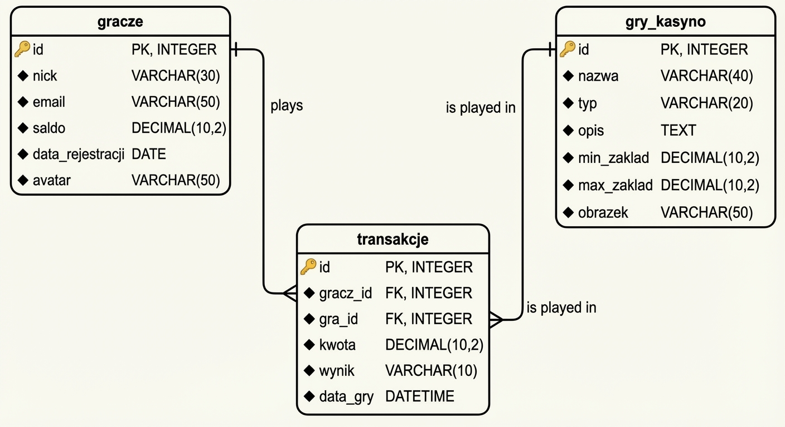

# Arkusz egzaminacyjny INF.03

---

**Nazwa kwalifikacji:** Tworzenie i administrowanie stronami i aplikacjami internetowymi oraz bazami danych  
**Symbol kwalifikacji:** INF.03  
**Numer zadania:** 02  
**Wersja arkusza:** KA  

Czas trwania egzaminu: **150 minut.**

---

## EGZAMIN ZAWODOWY  
### Rok 2026
### CZĘŚĆ PRAKTYCZNA  

---

### Instrukcja dla zdającego

Na pierwszej stronie arkusza egzaminacyjnego wpisz w oznaczonym miejscu swój numer PESEL i naklej naklejkę z numerem PESEL i z kodem ośrodka.
Na KARCIE OCENY w oznaczonym miejscu przyklej naklejkę z numerem PESEL oraz wpisz:
   - swój numer PESEL*,
   - oznaczenie kwalifikacji,
   - numer zadania,
   - numer stanowiska.
Zapoznaj się z treścią zadania oraz stanowiskiem egzaminacyjnym. Masz na to 10 minut. Czas ten nie jest wliczany do czasu trwania egzaminu.
Czas rozpoczęcia i zakończenia pracy zapisze w widocznym miejscu przewodniczący zespołu nadzorującego.
Wykonaj samodzielnie zadanie egzaminacyjne. Przestrzegaj zasad bezpieczeństwa i organizacji pracy.
Po zakończeniu wykonania zadania pozostaw arkusz egzaminacyjny z rezultatami oraz KARTĘ OCENY na swoim stanowisku lub w miejscu wskazanym przez przewodniczącego zespołu nadzorującego.
Po uzyskaniu zgody zespołu nadzorującego możesz opuścić salę/miejsce przeprowadzania egzaminu.

*Powodzenia!*

\* *w przypadku braku numeru PESEL – seria i numer paszportu lub innego dokumentu potwierdzającego tożsamość*

---

**Strona 2 z 7**

## Zadanie egzaminacyjne

*UWAGA: numer, którym został podpisany arkusz egzaminacyjny (PESEL lub w przypadku jego braku numer paszportu) jest w zadaniu nazywany **numerem zdającego**.*

Wykonaj aplikację internetową zawierającą stronę kasyna online, wykorzystując edytor grafiki rastrowej, pakiet XAMPP oraz edytor zaznaczający składnię.

Aby wykonać zadanie, należy zalogować się na konto **Egzamin** bez hasła. Na pulpicie znajduje się archiwum 7z o nazwie *pliki2* zabezpieczone hasłem: **Kasyno&OnlinE**

Archiwum należy rozpakować.

Na pulpicie konta Egzamin należy utworzyć folder. Jako nazwy folderu należy użyć numeru zdającego, którym został podpisany arkusz. Rozpakowane pliki należy umieścić w tym folderze. Po skończonej pracy wszystkie wyniki należy zapisać w tym folderze.

---

## Operacje na bazie danych

Baza danych jest zgodna ze strukturą przedstawioną na ilustracji 1.

### Ilustracja 1. Baza danych


Relacje: `transakcje.gracz_id` → `gracze.id`, `transakcje.gra_id` → `gry_kasyno.id`

W tabeli 2 umieszczono wybrane funkcje tekstowe dla bazy danych MariaDB. Za pomocą narzędzia phpMyAdmin wykonaj operacje na bazie danych:

- Utwórz bazę danych o nazwie **kasyno**, z zestawem polskich znaków (np. utf8_unicode_ci)
- Do bazy zaimportuj tabele z pliku *baza_kasyno.sql* z rozpakowanego archiwum
- Wykonaj zrzut ekranu po imporcie. Zrzut zapisz w formacie PNG pod nazwą **import**. Nie kadruj zrzutu. Powinien on obejmować cały ekran monitora, z widocznym paskiem zadań. Na zrzucie powinny być widoczne elementy wskazujące na poprawnie wykonany import tabel
- Wykonaj zapytania SQL działające na bazie **kasyno**. Zapytania zapisz w pliku **kwerendy.txt**. Wykonaj zrzuty ekranu przedstawiające wyniki działania kwerend. Zrzuty zapisz w formacie JPEG i nadaj im nazwy **kw1, kw2, kw3, kw4, kw5, kw6, kw7, kw8, kw9**. Zrzuty powinny obejmować cały ekran monitora z widocznym paskiem zadań

---

**Strona 3 z 7**

### Zapytania SQL

- **Zapytanie 1:** Używając CTE (Common Table Expression) o nazwie `top_gracze`, które wybiera `id`, `nick` i `saldo` z tabeli `gracze` gdzie saldo jest większe niż 500, wybierz z tego CTE jedynie `nick` i `saldo` posortowane malejąco po saldzie

- **Zapytanie 2:** Wybierające jedynie `nick`, pierwsze 80 znaków `email` oraz `saldo` z tabeli `gracze` dla wiersza o `id` równym 3

- **Zapytanie 3:** Używając CTE o nazwie `najlepsi`, które wybiera `nick` i `saldo` z tabeli `gracze`, wybierz z tego CTE pięć pierwszych wierszy o najwyższym saldzie

- **Zapytanie 4:** Wstawiające do tabeli `gracze` wiersz o danych zawartych w pliku *rekord_gracz.txt* (dane należy skopiować z pliku do zapytania). Klucz główny nadawany automatycznie

- **Zapytanie 5:** Wybierające jedynie `id`, `nazwa` i `obrazek` z tabeli `gry_kasyno`

- **Zapytanie 6:** Używając CTE o nazwie `statystyki`, które łączy tabele `transakcje` i `gracze` po polu `gracz_id = gracze.id` i wybiera `nick`, `kwota` oraz `wynik`, wybierz z tego CTE pole `nick` oraz sumę pola `kwota` pogrupowaną po `nick`

- **Zapytanie 7:** Wybierające jedynie `nazwa`, `typ` i `min_zaklad` z tabeli `gry_kasyno`, gdzie `typ` jest równy 'automat', posortowane rosnąco po `min_zaklad`

- **Zapytanie 8:** Używając CTE o nazwie `wygrane`, które wybiera z tabeli `transakcje` jedynie wiersze, w których pole `wynik` ma wartość 'wygrana', wybierz z tego CTE liczbę wierszy jako `liczba_wygranych`

- **Zapytanie 9:** Wstawiające do tabeli `transakcje` wiersz z wartościami: `gracz_id` = 1, `gra_id` = 2, `kwota` = 250.00, `wynik` = 'wygrana', `data_gry` = '2025-06-20 14:30:00'. Klucz główny nadawany automatycznie

---

**Strona 4 z 7**

## Witryna internetowa

### Przygotowanie grafiki:
- Plik *ruletka.jpg*, wypakowany z archiwum, należy przeskalować zachowując proporcje do szerokości **500 px**

### Cechy witryny:
- Składa się ze strony o nazwie **kasyno.php**
- Zapisana w języku HTML5
- Zadeklarowany polski język zawartości witryny
- Jawnie zastosowany właściwy standard kodowania polskich znaków
- Tytuł strony widoczny na karcie przeglądarki: „Kasyno Online"
- Arkusz stylów w pliku o nazwie **styl.css** prawidłowo połączony z kodem strony
- Podział strony na bloki zrealizowany za pomocą semantycznych znaczników bloków języka HTML5 tak, aby po uruchomieniu w przeglądarce układ bloków na stronie był zgodny z ilustracją 3

### Ilustracja 3. Układ bloków

```
┌─────────────────────────────────────┐
│          Blok nagłówkowy            │
├──────────┬──────────────┬───────────┤
│  Blok    │    Blok      │   Blok    │
│  sekcji  │   sekcji     │  sekcji   │
│  lewej   │  środkowej   │  prawej   │
├──────────┴──────────────┴───────────┤
│            Blok stopki              │
└─────────────────────────────────────┘
```

### Zawartość bloku nagłówkowego:
- Nagłówek pierwszego stopnia o treści „Kasyno Online – Graj i Wygrywaj"

### Zawartość sekcji lewej:
- Nagłówek trzeciego stopnia o treści: „Top 5 graczy"
- Lista punktowana (nieuporządkowana) wypełniona przez **skrypt 1**
- Nagłówek trzeciego stopnia o treści: „Pomoc"
- Odnośnik o treści „Regulamin kasyna" prowadzący do adresu `http://pomoc.kasyno.pl`
- Nagłówek trzeciego stopnia o treści: „Stronę wykonał"
- Paragraf z numerem zdającego

### Zawartość sekcji środkowej:
- Efekt działania **skryptu 2**

### Zawartość sekcji prawej:
- Nagłówek trzeciego stopnia o treści: „Dodaj nowego gracza"
- Formularz wysyłający dane do tego samego pliku metodą bezpieczną
- Formularz zawiera cztery pola edycyjne podpisane etykietami: **nick**, **email**, **saldo**, **avatar** oraz przycisk **DODAJ**

### Zawartość stopki:
- Formularz wysyłający dane do tego samego pliku metodą bezpieczną
- Formularz zawiera pole edycyjne i przycisk o treści „Pokaż profil"
- Efekt działania **skryptu 3**

---

**Strona 5 z 7**

## Styl CSS witryny internetowej

Styl CSS zdefiniowany jest w całości w zewnętrznym pliku o nazwie **styl.css**

Cechy formatowania CSS, działające na stronie:

- Domyślne formatowanie wszystkich selektorów: krój czcionki **Arial**, kolor czcionki **gold**
- Dla bloku nagłówkowego: kolor tła **#1a1a2e**, wyrównanie tekstu do środka, marginesy wewnętrzne **5 px**
- Dla sekcji lewej i prawej: kolor tła **#1a1a2e**, wysokość **600 px**
- Dla sekcji środkowej: kolor tła **#0f3460**, wysokość **600 px**, zawsze widoczne paski przewijania
- Dla wszystkich rodzajów ekranu o szerokości większej niż 800 px: szerokość sekcji lewej i prawej wynosi **20%**, środkowej **60%** (są wyświetlane obok siebie)
- Dla wszystkich rodzajów ekranu o pozostałej szerokości: sekcje lewa, środkowa i prawa są wyświetlane jedna pod drugą
- Dla stopki: kolor tła **#1a1a2e**, wysokość **150 px**
- Dla oznaczenia salda widocznego przy liście graczy: kolor tła **#e94560**, zaokrąglenie rogów **50%**, marginesy wewnętrzne **5 px**
- Dla elementu listy: marginesy wewnętrzne **5 px**
- Dla bloków gier znajdujących się w sekcji środkowej: bloki są umieszczone jeden obok drugiego, wyrównanie tekstu do środka, marginesy wewnętrzne **3 px**
- Dla pola edycyjnego: marginesy zewnętrzne **8 px**, kolor czcionki **#1a1a2e**

---

## Skrypt połączenia z bazą

W tabeli 1 podano wybór metod i właściwości obiektowego interfejsu MySQLi w języku PHP. Skrypty muszą korzystać z **paradygmatu obiektowego** (OOP). Wymagania dotyczące skryptów:

- Napisane w języku PHP z użyciem **paradygmatu obiektowego** (OOP)
- Należy stosować znaczące nazewnictwo zmiennych i funkcji w języku polskim lub angielskim
- Skrypty łączą się z serwerem bazodanowym na **localhost**, użytkownik **root** bez hasła, baza danych o nazwie **kasyno**

### Skrypt 1
- Wysyła do bazy danych **zapytanie 3** (z użyciem CTE)
- Zwrócone wiersze są wyświetlane w pętli **for** w elementach listy z sekcji lewej według wzoru: „`<nick>` `<saldo>`", gdzie nawiasy `<>` oznaczają wartość pobraną z bazy danych. Kwota salda jest dodatkowo formatowana stylem, którego efekt jest widoczny na ilustracji 4
- Pętla **for** iteruje od 0 do liczby wierszy wyniku zapytania

### Skrypt 2
- Wysyła do bazy danych **zapytanie 5**
- Zwrócone zapytaniem wiersze są wyświetlone w pętli **for** w bloku, który składa się z:
  - Obrazu, którego źródłem jest pole `obrazek`, tekstem alternatywnym jest pole `nazwa`, a podpowiedzią (dymek) jest pole `id`
  - Paragrafu z nazwą gry

### Skrypt 3 związany z formularzem w stopce
- Jeżeli wpisano id do pola edycyjnego, skrypt wysyła do bazy danych **zapytanie 2** zmodyfikowane tak, że wybierany jest wiersz o `id` podanym w polu edycyjnym
- Zwrócony zapytaniem wiersz jest wyświetlany pod formularzem według wzoru:
  - W nagłówku drugiego stopnia: „`<nick>`, saldo: `<saldo>` zł"
  - Email w paragrafie

### Skrypt 4 związany z formularzem z sekcji prawej
- Jeżeli wypełniono pole nick, skrypt wysyła do bazy zmodyfikowane **zapytanie 4** w ten sposób, że wstawione są wartości pobrane z formularza, a `data_rejestracji` ustawiana jest na aktualną datę (funkcja SQL `CURDATE()`)
- Na końcu jest zamykane połączenie z serwerem.

---

**Strona 6 z 7**

### Tabela 1. Wybór metod i właściwości obiektowego interfejsu MySQLi w PHP

| Składnia obiektowa | Zwracana wartość / Opis |
|---|---|
| `$db = new mysqli(serwer, użytkownik, hasło, nazwa_bazy)` | Obiekt połączenia z bazą danych |
| `$db->connect_error` | Tekst komunikatu błędu połączenia lub `null` gdy połączono pomyślnie |
| `$db->error` | Tekst ostatniego komunikatu błędu zapytania |
| `$db->query(zapytanie)` | Obiekt wyniku zapytania dla SELECT lub `true`/`false` dla INSERT/UPDATE/DELETE |
| `$db->close()` | `true`/`false` w zależności od stanu operacji |
| `$wynik->fetch_assoc()` | Tablica asocjacyjna zawierająca kolejny wiersz wyniku lub `null` gdy brak wierszy |
| `$wynik->fetch_row()` | Tablica numeryczna zawierająca kolejny wiersz wyniku lub `null` gdy brak wierszy |
| `$wynik->num_rows` | Liczba wierszy w wyniku zapytania (właściwość typu `int`) |
| `$wynik->num_fields` | Liczba kolumn w wyniku zapytania (właściwość typu `int`) |
| `$wynik->free()` | Zwalnia pamięć zajmowaną przez wynik zapytania |
| `isset($zmienna)` | `true`/`false` w zależności od tego, czy `$zmienna` istnieje |

### Tabela 2. Wybrane funkcje tekstowe w MariaDB

| Funkcja | Opis |
|---|---|
| `LEFT(exp, n)` | Dla wyrażenia napisowego exp zwraca n znaków od lewej strony |
| `RIGHT(exp, n)` | Dla wyrażenia napisowego exp zwraca n znaków od prawej strony |
| `CURDATE()` | Zwraca aktualną datę w formacie YYYY-MM-DD |
| `NOW()` | Zwraca aktualną datę i czas w formacie YYYY-MM-DD HH:MM:SS |

### Tabela 3. Semantic Elements in HTML

| Tag | Description |
|---|---|
| `<article>` | Defines independent, self-contained content |
| `<aside>` | Defines content aside from the page content |
| `<details>` | Defines additional details that the user can view or hide |
| `<figcaption>` | Defines a caption for a `<figure>` element |
| `<figure>` | Specifies self-contained content, like illustrations, diagrams, photos, code listings, etc. |
| `<footer>` | Defines a footer for a document or section |
| `<header>` | Specifies a header for a document or section |
| `<main>` | Specifies the main content of a document |
| `<mark>` | Defines marked/highlighted text |
| `<nav>` | Defines navigation links |
| `<section>` | Defines a section in a document |
| `<summary>` | Defines a visible heading for a `<details>` element |
| `<time>` | Defines a date/time |

---

**UWAGA:** po zakończeniu pracy utwórz plik tekstowy o nazwie **przegladarka.txt**. Zapisz w nim nazwę przeglądarki internetowej, w której weryfikowana była poprawność działania witryny. Umieść go w folderze z numerem zdającego.

Nagraj płytę z rezultatami pracy. W folderze z numerem zdającego, powinny znajdować się pliki: kasyno.php, import.png, kw1.jpg, kw2.jpg, kw3.jpg, kw4.jpg, kw5.jpg, kw6.jpg, kw7.jpg, kw8.jpg, kw9.jpg, kwerendy.txt, styl.css, ruletka.jpg, przegladarka.txt, pliki graficzne gier, ewentualnie inne przygotowane pliki. Po nagraniu płyty sprawdź poprawność jej odczytu. Opisz płytę numerem zdającego, którym został podpisany arkusz i pozostaw zapakowaną w pudełku na stanowisku wraz z arkuszem egzaminacyjnym.

---

**Strona 7 z 7**

**Czas przeznaczony na wykonanie zadania wynosi 150 minut.**

**Ocenie będzie podlegać 5 rezultatów:**
- operacje na bazie danych,
- zawartość witryny internetowej,
- działanie witryny internetowej,
- styl CSS witryny internetowej,
- skrypt połączenia z bazą (paradygmat obiektowy).